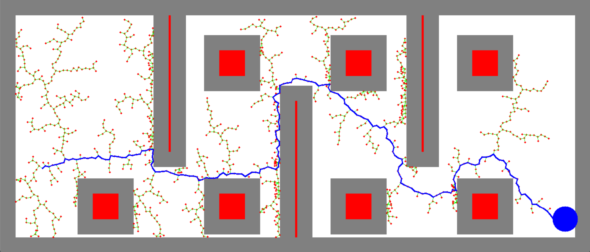
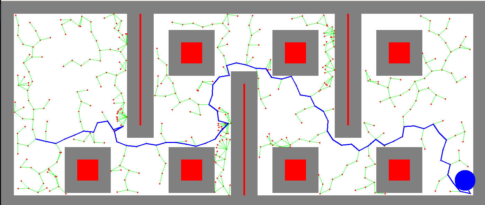

# Fast-RRT Based Optimal Pathfinding Algorithm

This project implements the **Fast-RRT algorithm** for optimal pathfinding in complex environments. The algorithm combines **Fast-Sampling** and **Random-Steering** strategies to overcome the limitations of traditional RRT and RRT*, offering faster and more efficient pathfinding.

## Features
- **Fast-Sampling Strategy:** Reduces redundant expansions and focuses on unexplored areas for faster convergence.
- **Random-Steering Mechanism:** Effectively handles narrow passages and constrained environments.
- **Visualization:** Displays the obstacle map and the path found in a simulated 2D environment.

## Technologies and Libraries
- **Programming Language:** Python
- **Libraries Used:**
  - `numpy` for numerical computations.
  - `cv2` (OpenCV) for visualization and image processing.
  - `random` for random number generation.
  - `time` for execution time measurement.

## Prerequisites
Ensure the following Python libraries are installed:
- `numpy`
- `opencv-python`

Install them using `pip` if necessary:
```bash
pip install numpy opencv-python
```
## Running the Code
- Clone this repository:
```bash
git clone https://github.com/<your-repo>/fast-rrt-non-ros.git
```
- Run the script:
```bash
python 43_fast_rrt.py
```
## Algorithm Details
- The Fast-RRT algorithm improves pathfinding by:
  - Avoiding redundant sampling in already explored areas.
  - Adapting to narrow passages using random steering.
  - Efficiently exploring the configuration space with a user-defined step size.
## Code Structure
 - `main()`
   - Sets up the 2D environment with obstacles and goal positions.
   - Generates and visualizes the path using Fast-RRT.
- `improved_rrt()`
   - Core function implementing the RRT algorithm with enhancements.
- `fast_sample()` and `random_steer()`
   - Auxiliary functions for sampling and navigation in complex areas.
- Visualization:
   - Obstacles are drawn using OpenCV shapes, and the resulting path is highlighted.
## Results


- Performance Comparison:
   - Fast-RRT significantly outperforms traditional RRT and RRT* algorithms in terms of computation time.
   - Achieves up to 20x faster results in challenging scenarios.
## References
- Wu et al., "Fast-RRT: A RRT-based optimal path finding method," Applied Sciences (Switzerland), 2021. DOI: 10.3390/app112411777
- Zhang et al., "An Improved Path Planning Algorithm Based on RRT," ICTech 2022. DOI: 10.1109/ICTech55460.2022.00037
